# Splinch xiao
this is a 60 keys split ortho col staggered wireless keyboard that uses the 
xiao nrf52840 as its micro controller and zmk as firmwere.

i decided to build this because my current 60% razer gaming keeb, which has really bad software, hurts my wrist, ugly and sounds really annoying.
i got the idea to build this when i saw the ferris sweep on youtube and it looked supppppper cool.

BOM:
| name | quantity | value | lcsc # | price | source | pic |
|:----:|:--------:|:-----:|:------:|:-----:|:------:|:---:|
| choc switches | 58 | - | - | 30$ | https://he.aliexpress.com/item/1005010420712566.html?spm=a2g0o.productlist.main.1.11ab2b90LGevbR&algo_pvid=d8d7e0e8-cffe-4196-91ff-b4abaa745b96&algo_exp_id=d8d7e0e8-cffe-4196-91ff-b4abaa745b96-0&pdp_ext_f=%7B%22order%22%3A%2236%22%2C%22eval%22%3A%221%22%2C%22fromPage%22%3A%22search%22%7D&pdp_npi=6%40dis%21USD%216.36%216.36%21%21%2143.76%2143.76%21%402102f0c917748197491514129eb60f%2112000052353413886%21sea%21IL%217476082455%21X%211%210%21n_tag%3A-29912%3Bd%3A60dc0150%3Bm03_new_user%3A-29895&curPageLogUid=ZHzoQkRR7Oa6&utparam-url=scene%3Asearch%7Cquery_from%3A%7Cx_object_id%3A1005010420712566%7C_p_origin_prod%3A | 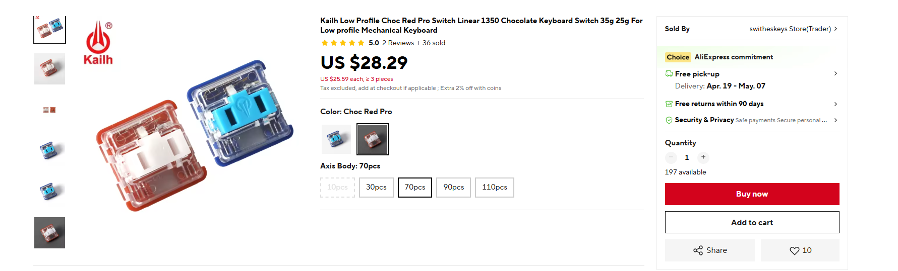 |
| choc hot swap socket | 58 | - | - | 20$ | https://he.aliexpress.com/item/33023283633.html?spm=a2g0o.productlist.main.5.625aaiMxaiMxIK&algo_pvid=4ddc268d-7e73-4a14-8662-a3181d01b6c9&algo_exp_id=4ddc268d-7e73-4a14-8662-a3181d01b6c9-4&pdp_ext_f=%7B%22order%22%3A%2240%22%2C%22eval%22%3A%221%22%2C%22fromPage%22%3A%22search%22%7D&pdp_npi=6%40dis%21USD%2113.03%2113.03%21%21%2113.03%2113.03%21%40213ba0c517748199308948942ed8d1%2167259936710%21sea%21IL%217476082455%21X%211%210%21n_tag%3A-29912%3Bd%3A60dc0150%3Bm03_new_user%3A-29895&curPageLogUid=z1nXS3cwvgxl&utparam-url=scene%3Asearch%7Cquery_from%3A%7Cx_object_id%3A33023283633%7C_p_origin_prod%3A | 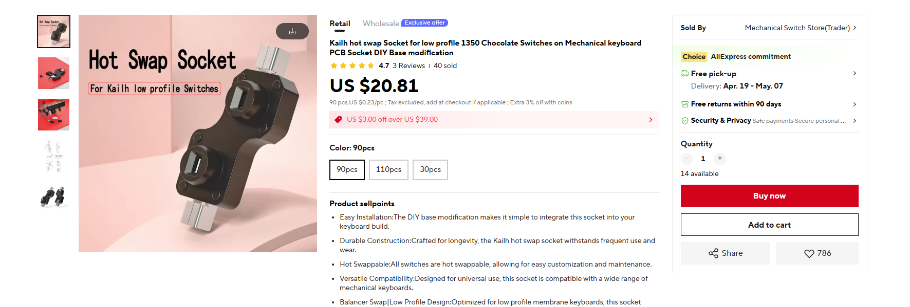 |
| diodes | 58 | 1N4148W (SOD-123) | C2128 |
| resistor | 2 | 0805, 2M | C106170 | 
| resistor | 2 | 0805, 806k | C63494 |
| keycaps | 58 | - | - | 27$ | https://he.aliexpress.com/item/1005010385514024.html?spm=a2g0o.productlist.main.7.3c216a2cTzDzSy&algo_pvid=79fb82ab-d5dc-4773-af73-70ee35ab3c04&algo_exp_id=79fb82ab-d5dc-4773-af73-70ee35ab3c04-6&pdp_ext_f=%7B%22order%22%3A%2234%22%2C%22eval%22%3A%221%22%2C%22fromPage%22%3A%22search%22%7D&pdp_npi=6%40dis%21USD%213.95%213.41%21%21%213.95%213.41%21%40212a6e2917748200627686778ebed9%2112000052228852476%21sea%21IL%217476082455%21X%211%210%21n_tag%3A-29912%3Bd%3A60dc0150%3Bm03_new_user%3A-29895&curPageLogUid=Ni8of9UZsCqr&utparam-url=scene%3Asearch%7Cquery_from%3A%7Cx_object_id%3A1005010385514024%7C_p_origin_prod%3A | 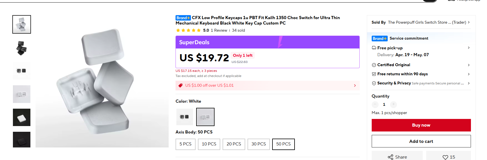 |
| nrf52 xiao | 2 | - | - | 40$ | https://he.aliexpress.com/item/1005006988954136.html?spm=a2g0o.productlist.main.1.57ce40b4QXnPng&algo_pvid=f9b91e77-0c87-4e99-935a-fb38f1f5f0a7&algo_exp_id=f9b91e77-0c87-4e99-935a-fb38f1f5f0a7-0&pdp_ext_f=%7B%22order%22%3A%222000%22%2C%22spu_best_type%22%3A%22price%22%2C%22eval%22%3A%221%22%2C%22fromPage%22%3A%22search%22%7D&pdp_npi=6%40dis%21USD%2118.24%2110.58%21%21%21125.54%2172.81%21%402140e67317748203008007890e5056%2112000042942288177%21sea%21IL%217476082455%21X%211%210%21n_tag%3A-29912%3Bd%3A60dc0150%3Bm03_new_user%3A-29895&curPageLogUid=wBoNLOG3rDIr&utparam-url=scene%3Asearch%7Cquery_from%3A%7Cx_object_id%3A1005006988954136%7C_p_origin_prod%3A | 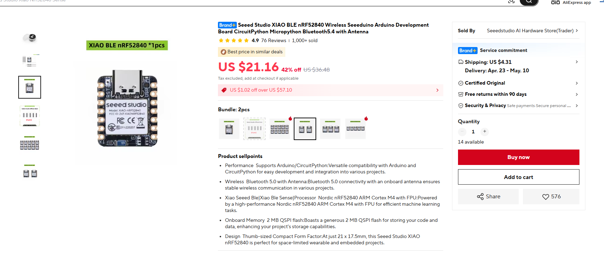 |
| switch | 2 | MSK12C02 | - |
| screws | 8 | m2 | - |
| silicone feet | some | - | - | 7$ | https://he.aliexpress.com/item/1005010241201821.html?spm=a2g0o.productlist.main.27.163736427Ym5ki&algo_pvid=df98ee35-a38e-4c63-a4ad-8a2221e94798&algo_exp_id=df98ee35-a38e-4c63-a4ad-8a2221e94798-26&pdp_ext_f=%7B%22order%22%3A%22149%22%2C%22eval%22%3A%221%22%2C%22fromPage%22%3A%22search%22%7D&pdp_npi=6%40dis%21USD%217.39%213.55%21%21%2150.88%2124.42%21%40210141f717748203947087454e4ff5%2112000051650167405%21sea%21IL%217476082455%21X%211%210%21n_tag%3A-29912%3Bd%3A60dc0150%3Bm03_new_user%3A-29895&curPageLogUid=sZyKOcIq8vIl&utparam-url=scene%3Asearch%7Cquery_from%3A%7Cx_object_id%3A1005010241201821%7C_p_origin_prod%3A | 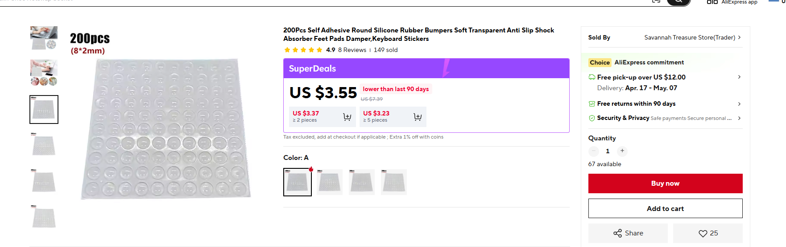 |
| nice nano | 1 | - | - | - | - | - |
| TOTAL | - | - | - | 124$ | - | - |

in order to complete that you also need the pcb. you can choose to use the pcba or assamble it yourself. i reccomend to use the pcba with the ressistors and the doides, and hand soldering the others.
this is the pcb:
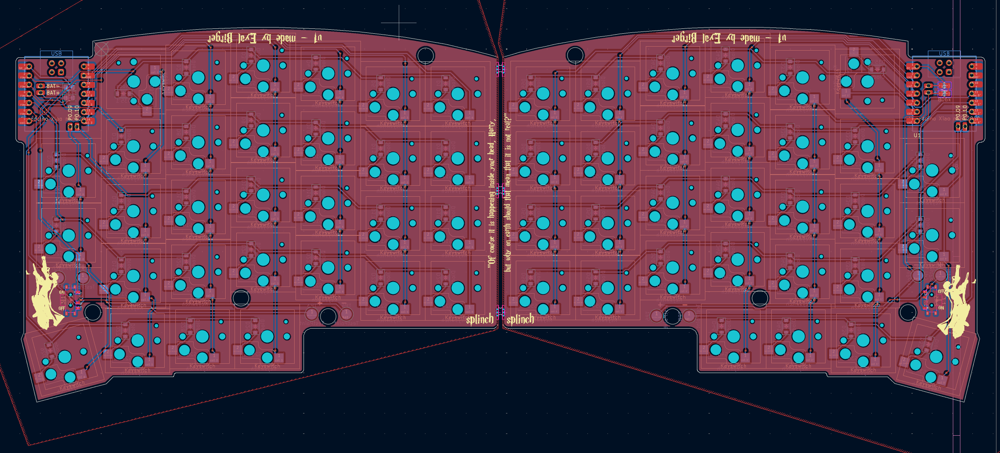
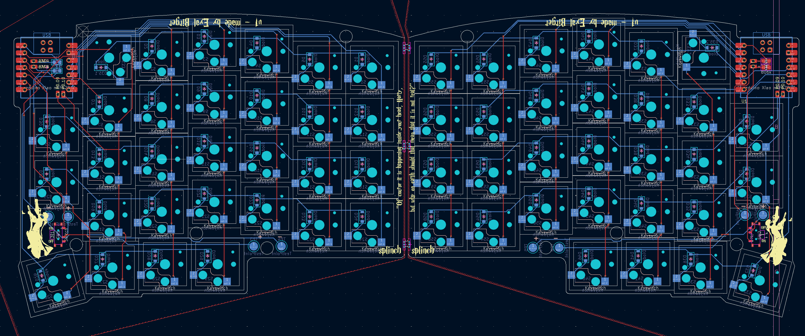
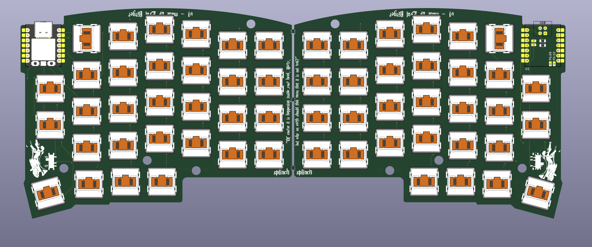

this is the case:
you need **8 m2 standoffs**, you can glue them with superglue into the standoff holes.
you also need **8 m2 screws** to screw the pcb to the case.
you can put a **6mm (max) thick battery**.
you need to mirror the case for the left part.
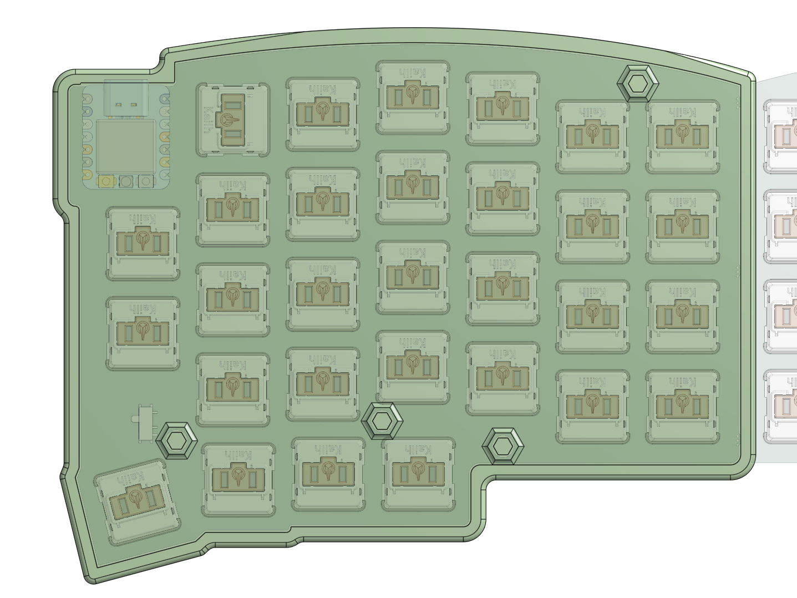
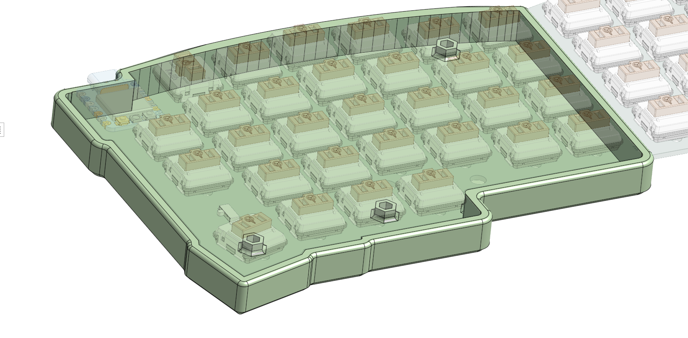
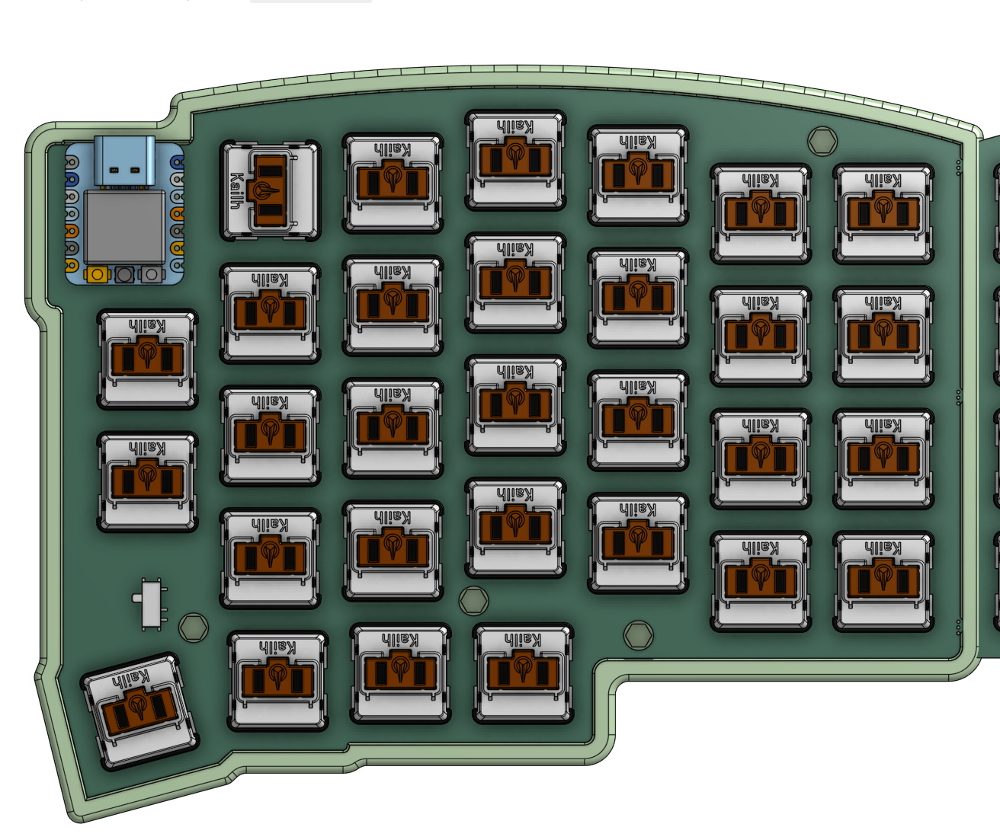
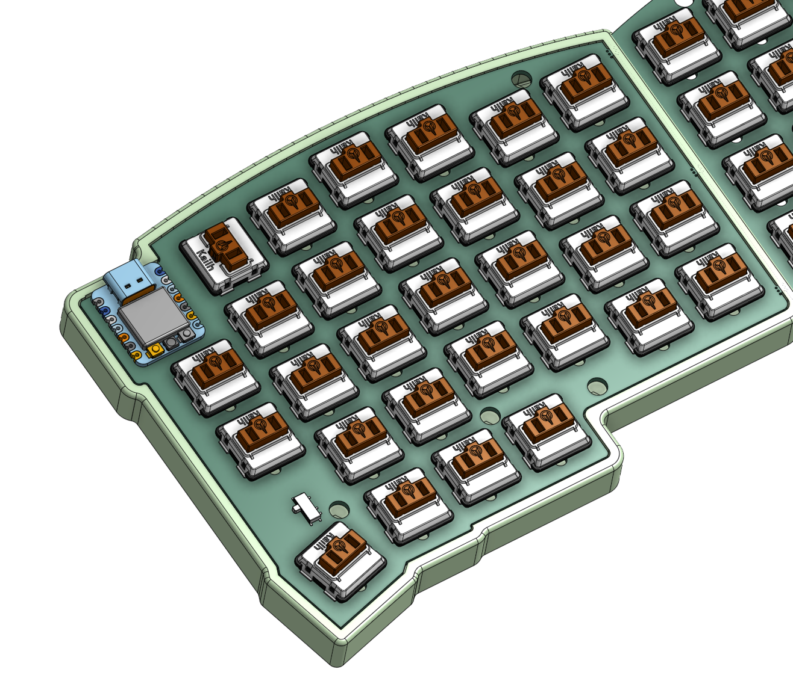

firmware: https://github.com/eyalbirger/zmk-config-splinch.git
i still need to complete and test the firmware (i have like one build error), but it will probably be completed in a few days (i have a war to deal with, so you know...).